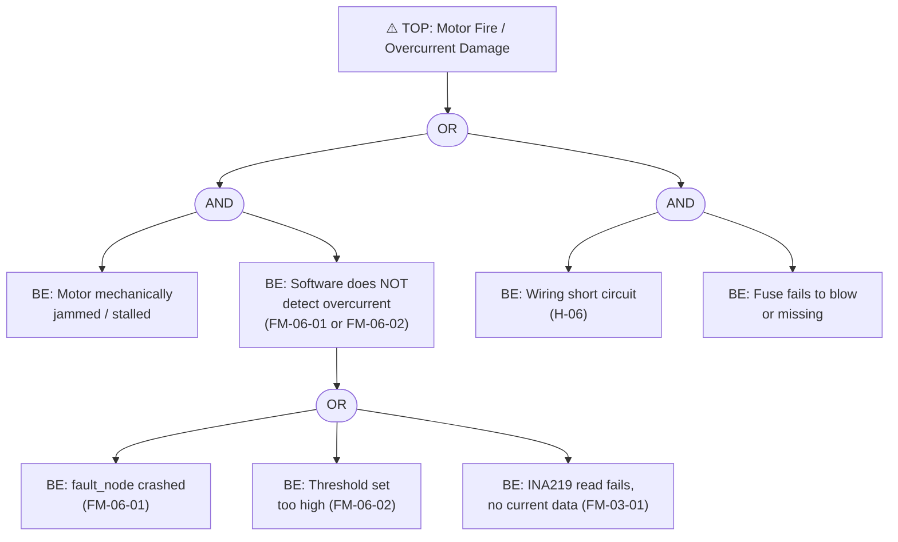
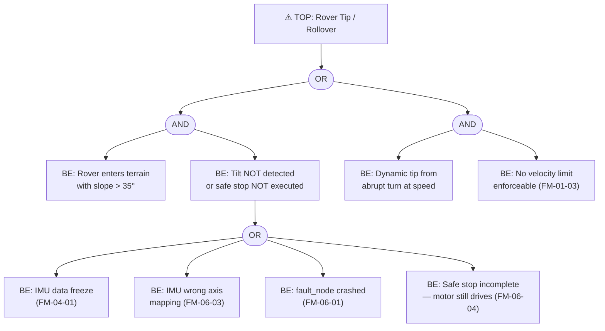
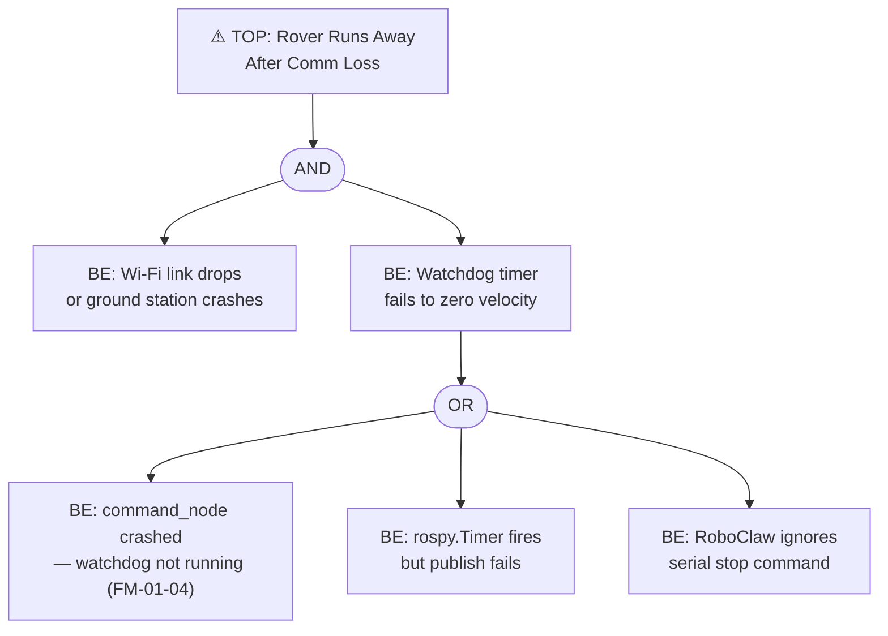

# Fault Tree Analysis

**Document:** OSR-SAF-FTA-001
**Status:** DRAFT

Fault trees for the three highest-risk top-level hazards.
Each tree is an AND/OR logic decomposition to basic events (hardware faults, software
bugs, human errors) that can cause the top-level hazard.

---

## FTA-01 — Motor Overcurrent / Fire (H-01)

**Cut sets (minimal):**
- `{Motor stalled} AND {fault_node crashed}` — independent hardware + software failure
- `{Motor stalled} AND {threshold too high}` — configuration error
- `{Short circuit} AND {fuse missing/failed}` — assembly error

**Safety requirement derived:** REQ-SF-06-01: SF-06.1 shall trigger safe stop within 100 ms of detecting motor current > 10 A on any channel.

---

## FTA-02 — Rover Tip / Rollover (H-02)

**Cut sets:**
- `{Steep terrain} AND {IMU freeze}` — sensor failure on difficult terrain
- `{Steep terrain} AND {wrong axis mapping}` — installation/config error
- `{Steep terrain} AND {fault_node crash}` — software failure on difficult terrain
- `{Abrupt turn at speed} AND {velocity limit bypass}` — software + maneuver

**Safety requirement derived:** REQ-SF-06-03: SF-06.3 shall monitor both roll and pitch axes; threshold 35°; response within one IMU sample period (20 ms).

---

## FTA-03 — Runaway on Communication Loss (H-04)

**Cut sets:**
- `{Wi-Fi drops} AND {command_node crashed}` — dual failure required
- `{Wi-Fi drops} AND {serial stop fails}` — very unlikely (RoboClaw HW timeout)

**Note:** This is an AND gate at the top — comm loss alone is NOT sufficient to cause runaway if the watchdog works. The design is resilient by requiring two simultaneous failures.

**Safety requirement derived:** REQ-SF-01-04: The command watchdog shall issue zero velocity within 1.0 s of /cmd_vel topic silence, independent of any other fault condition.

---

## Summary — Basic Events by Category

| Category | Basic Events | Primary Mitigation |
|---|---|---|
| **Software crash** | FM-06-01 (fault_node), FM-01-04 (watchdog), FM-04-01 (IMU node) | ROS respawn + RoboClaw hardware timeout |
| **Sensor failure** | FM-03-01 (INA219), FM-04-01 (IMU freeze) | /diagnostics staleness alerts |
| **Configuration error** | FM-06-02 (threshold), FM-06-03 (axis mapping) | Calibration checklist at first power-on |
| **Mechanical failure** | Motor stall, wiring short | Blade fuses, torque checks, continuity test |
| **Assembly error** | Missing fuse, IMU wrong orientation | Build checklist (OAct-03.3) |
| **Environmental** | Steep terrain, Wi-Fi dropout | Operational procedure; safety observer |
