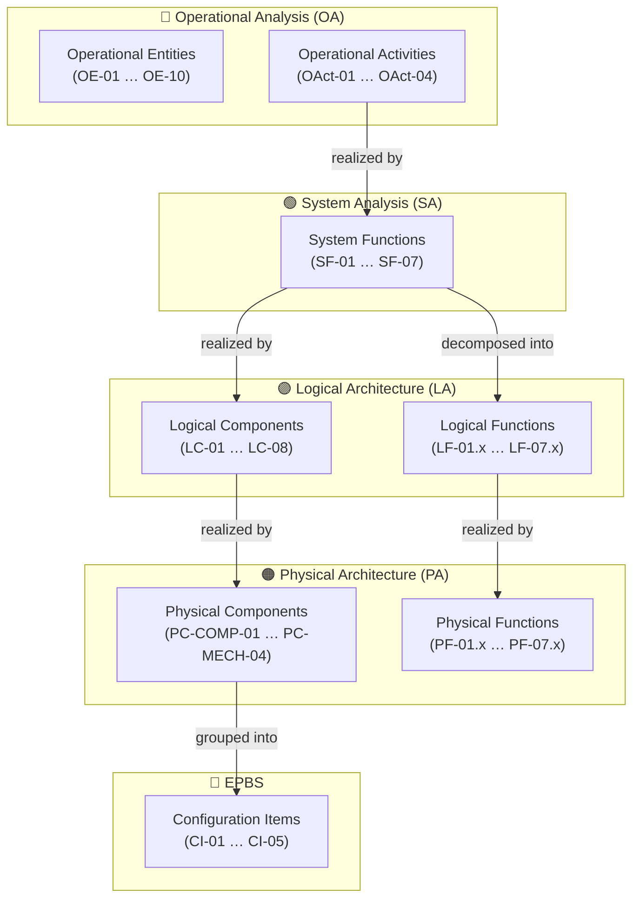
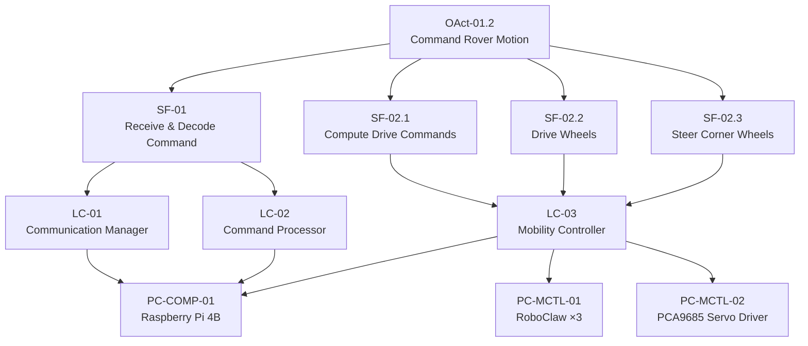
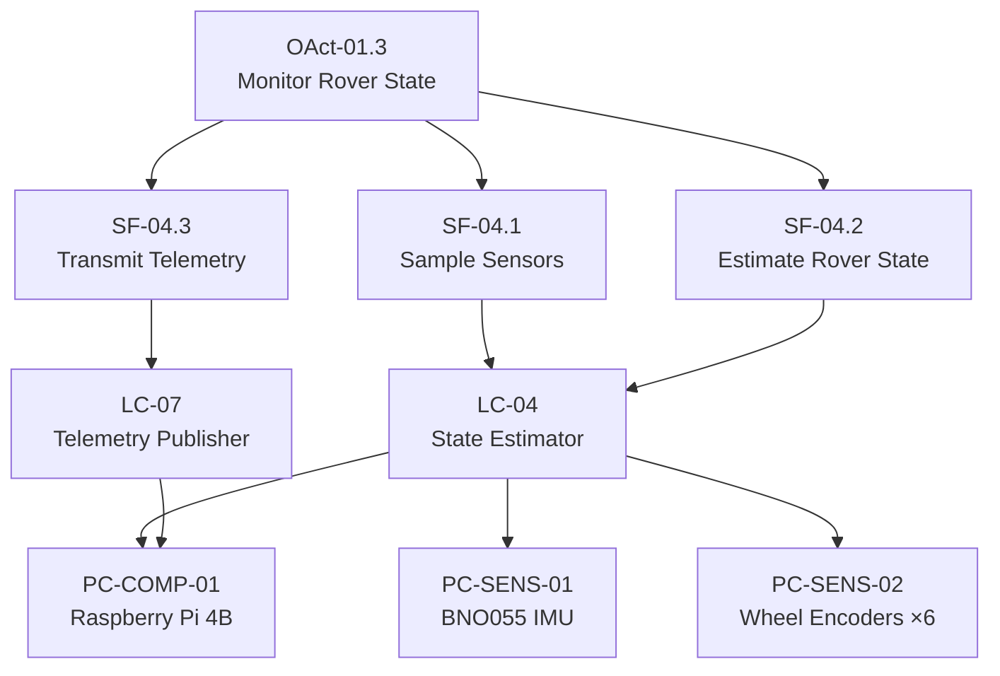
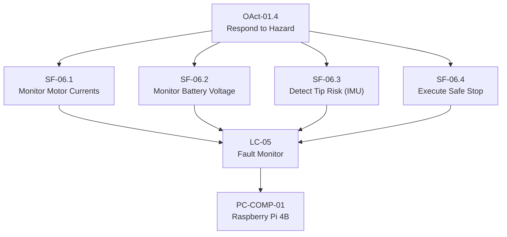
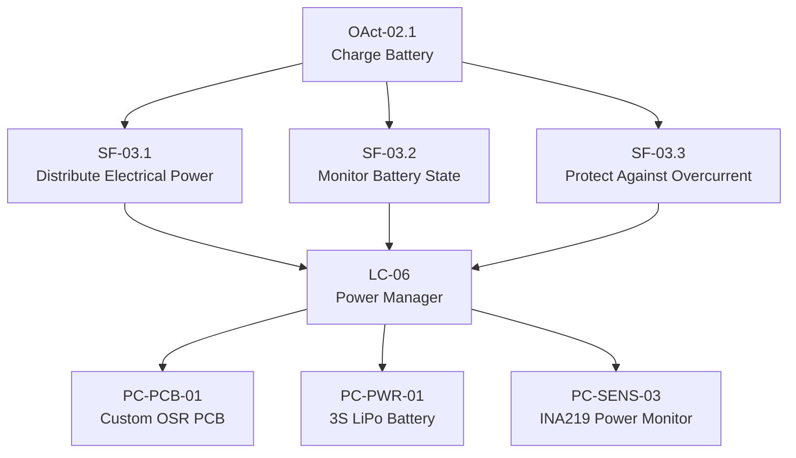

# Cross-Layer Traceability

This page visualises the vertical traceability chains that link the OSR MBSE model
across all five Arcadia layers: Operational Analysis → System Analysis →
Logical Architecture → Physical Architecture → EPBS.

For the interactive, clickable version open the
**[Model Viewer](MBSE_workspace/model_viewer.html)** and click the **Graph** button
in the top-right corner.

---

## Layer Stack Overview

---

## Motion Control Chain

Traces how an operator command flows from the operational world through to physical hardware.

---

## Telemetry & State Estimation Chain

---

## Fault Detection Chain

---

## Power Management Chain

---

## EPBS Configuration Item Breakdown

```mermaid
flowchart TD
    CI01["CI-01\nOSR Software Stack\n(CSCI)"]
    CI02["CI-02\nCompute Hardware\n(HWCI)"]
    CI03["CI-03\nMotor Drive System\n(HWCI)"]
    CI04["CI-04\nPower & Sensing System\n(HWCI)"]
    CI05["CI-05\nMechanical Structure\n(HWCI)"]

    PCRPI["PC-COMP-01\nRaspberry Pi 4B"]
    PCRC["PC-MCTL-01\nRoboClaw ×3"]
    PCPCA["PC-MCTL-02\nPCA9685"]
    PCPCB["PC-PCB-01\nCustom PCB"]
    PCPWR["PC-PWR-01\n3S LiPo"]
    PCIMU["PC-SENS-01\nBNO055 IMU"]
    PCENC["PC-SENS-02\nEncoders ×6"]
    PCINA["PC-SENS-03\nINA219"]
    PCCAM["PC-CAM-01\nCamera"]
    PCMOT["PC-MECH-01\nDrive Motors ×6"]
    PCSRV["PC-MECH-02\nSteering Servos ×4"]
    PCCHS["PC-MECH-03\nRocker-Bogie Chassis"]
    PCWHL["PC-MECH-04\nWheel Assembly ×6"]

    CI01 --> PCRPI
    CI02 --> PCRPI
    CI03 --> PCRC
    CI03 --> PCPCA
    CI03 --> PCMOT
    CI03 --> PCSRV
    CI04 --> PCPCB
    CI04 --> PCPWR
    CI04 --> PCIMU
    CI04 --> PCENC
    CI04 --> PCINA
    CI04 --> PCCAM
    CI05 --> PCCHS
    CI05 --> PCWHL
```

---

## Reading the Diagrams

| Arrow | Meaning |
|---|---|
| `A --> B` | A is realized by / decomposes into B |
| `A -->|"realized by"| B` | Explicit realization link |

All element IDs match the full MBSE model.
Cross-reference with the [Requirements Register](requirements_register.md) for
the requirements associated with each element.
